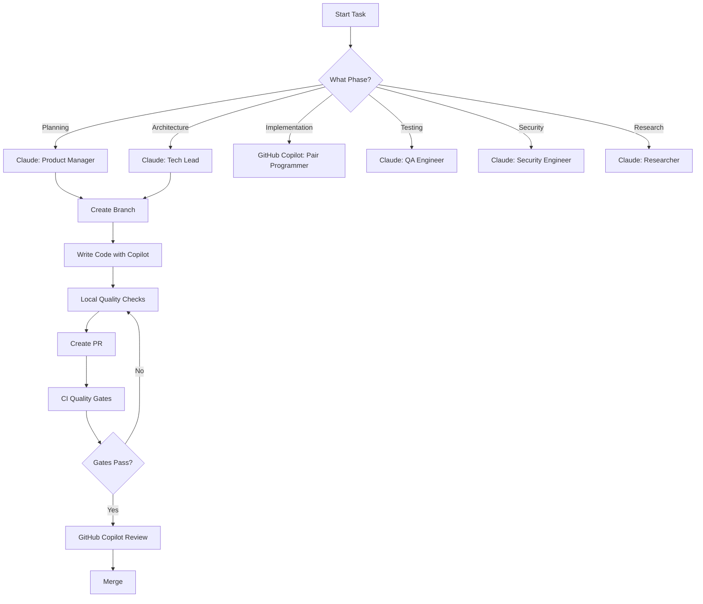

# AI Tooling Setup — Complete Configuration Guide

> **Status**: Production-ready AI-powered development workflow  
> **Last Updated**: 2025-10-15  
> **S-Tier**: S2 (Standardized)

## Overview

ShopMatch Pro implements a comprehensive AI-powered development workflow enabling **solo developers to operate at team velocity** while maintaining enterprise-grade quality. This document provides the complete configuration status and integration guide for all AI tools.

---

## ✅ Completed AI Tool Configurations

### 1. **Claude AI (claude.ai/code)** — Primary Development Assistant

**Status**: ✅ **Fully Configured**

**Configuration File**: `/CLAUDE.md` (1,023 lines)

**Features**:
- 6 AI personas with copy-paste ready prompts:
  - **Product Manager**: "Why this way?" business rationale
  - **Tech Lead**: "Build on existing" minimal architectural changes
  - **QA Engineer**: Complete test plans (unit/component/E2E)
  - **Security Engineer**: Threat modeling and vulnerability analysis
  - **Pair Programmer**: Step-by-step implementation diffs
  - **Researcher**: Landscape drift monitoring (2025 updates)
- SHOOT→SKIN methodology workflow
- Quality gates and evidence requirements
- Decision Matrix integration (weights: Business Fit 25, Maturity 20, Cost 15, Capability 15, Ecosystem 10, Security 10, Performance 5)
- Automation recommendations (Raycast, Stream Deck, iOS Shortcuts)

**Usage**:
```bash
# When working with Claude, always prepend:
"Use my Technology Landscape 2025 & S2 maturity. 
If you choose tech, justify using my Decision Matrix weights."

# Then use persona-specific prompts from docs/PROMPT_PACK.md
```

**Local Configuration**: `.claude/settings.local.json` with auto-approved commands

---

### 2. **GitHub Copilot** — Code Review & Test Coverage Buddy

**Status**: ✅ **Fully Configured**

**Configuration File**: `/.github/copilot-instructions.md` (400+ lines)

**Role**: Staff Line Reviewer & Test-Coverage Buddy

**Features**:
- Branch naming enforcement: `type/<ID>-<slug>`
- Conventional Commits standard
- PR title format: `[ID] Description (L6/L5)`
- 10-point review checklist:
  1. Type Safety (strict TS, no `any`, Zod validation)
  2. Security (auth, validation, rate-limiting, no secrets)
  3. Performance (≤300KB first-load JS, code-splitting)
  4. Accessibility (zero axe violations, ARIA, semantic HTML)
  5. Firestore (rule scoping, indexes, row-level security)
  6. Stripe (runtime='nodejs', webhook verification, no PII logging)
  7. Testing (unit + E2E required)
  8. Observability (analytics events, structured logging)
  9. Documentation (README/docs updated)
  10. Evidence (test output, screenshots, metrics)
- Common issues flagging (critical, high, medium, low priority)
- Links to key documents (CONTRIBUTING, SECURITY, TESTING, ARCHITECTURE, OBSERVABILITY)

**How It Works**:
When GitHub Copilot code review is enabled on your repository:
1. GitHub automatically loads `.github/copilot-instructions.md`
2. Copilot references these guidelines when reviewing PRs
3. Ensures consistent application of your standards across all reviews

**Activation**:
```bash
# Enable GitHub Copilot code review in repository settings:
# Settings → Code security and analysis → GitHub Copilot → Enable
```

---

### 3. **CI/CD Quality Gates** — Automated Enforcement

**Status**: ✅ **Fully Implemented**

**Configuration File**: `/.github/workflows/ci.yml` (250+ lines)

**Jobs**:

#### **validate-branch** (NEW)
- Enforces `type/<ID>-<slug>` branch naming convention
- Validates on all pull requests
- Provides helpful error messages with examples
- Blocks merge if branch name invalid

#### **build**
- Runs on Node.js 18.x and 20.x
- Linting (ESLint)
- Type checking (TypeScript strict mode)
- Production build
- **First-load JS budget enforcement** (≤300KB)
  - Measured via Playwright
  - Uploads `first-load-report.json` artifact
  - Fails build if exceeds budget

#### **accessibility**
- **Zero tolerance for WCAG violations**
- Uses `@axe-core/playwright` for automated testing
- Tests 3 critical pages: `/`, `/dashboard`, `/subscribe`
- Uploads detailed accessibility reports
- Blocks merge if violations found

**Quality Gates**:
```bash
# Local testing commands
npm run lint                    # ESLint
npm run typecheck              # TypeScript
npm run build                  # Production build
FIRST_LOAD_BUDGET_KB=300 node scripts/ci/measure-first-load.mjs  # Bundle check
npm run test:e2e               # Accessibility tests
```

---

### 4. **Branch & PR Standards** — Workflow Enforcement

**Status**: ✅ **Documented & Automated**

**Branch Naming**:
- **Format**: `type/<ID>-<slug>`
- **Types**: `feat`, `fix`, `docs`, `refactor`, `test`, `chore`, `perf`, `ci`
- **Examples**:
  - ✅ `feat/MP-123-stripe-checkout`
  - ✅ `fix/MP-124-auth-redirect`
  - ✅ `docs/MP-125-api-reference`
  - ❌ `feature-branch`
  - ❌ `MP-123-my-feature`
- **Enforcement**: CI job `validate-branch` blocks PRs with invalid names

**Commit Messages**:
- **Standard**: Conventional Commits
- **Format**: `type(scope): description`
- **Examples**:
  - `feat(auth): add Google OAuth integration`
  - `fix(stripe): handle webhook signature validation`
  - `docs(testing): update E2E test documentation`

**PR Title Format**:
- **Format**: `[ID] Description (L6/L5)`
- **Examples**:
  - `[MP-123] Add Stripe checkout flow (L6)`
  - `[MP-124] Fix authentication redirect loop (L5)`

**PR Template**: `.github/pull_request_template.md`
- Acceptance criteria checklist
- Evidence requirements:
  - E2E test output or Playwright report
  - First-load JS report from CI artifacts
  - Accessibility report (if UI changes)
  - Coverage % (if adding logic)
  - Screenshots/logs (for visual changes)

---

### 5. **Documentation Infrastructure** — Knowledge Base

**Status**: ✅ **Complete & Organized**

**Structure**:
```
docs/
├── README.md                        # Canonical index
├── ARCHITECTURE.md                  # System design, data flows
├── SECURITY.md                      # Auth, roles, threat model
├── TESTING.md                       # Test pyramid, budgets, gates
├── DEPLOYMENT.md                    # Vercel + Stripe webhook checklist
├── OBSERVABILITY.md                 # Events, logs, metrics
├── ANALYTICS_SCHEMA.md              # PM event taxonomy
├── FIRESTORE_RULES_SPEC.md          # Rules spec + emulator tests
├── WORKFLOW_ORDER.md                # End-to-end workflow (AIM → SKIN)
├── PROMPT_PACK.md                   # Persona prompts for AI tools
├── PLAYBOOK_SHOPMATCH.md            # SOP for each task
├── INCIDENT_RESPONSE.md             # Incident handling procedures
├── AI_TOOLING_SETUP.md              # This document
├── adr/                             # Architecture Decision Records
│   ├── 0001-payments-stripe.md
│   ├── 0002-auth-firestore.md
│   └── 0003-hosting-vercel.md
└── runbooks/
    └── STRIPE_WEBHOOK_RUNBOOK.md
```

**Root-Level**:
- `CLAUDE.md` — AI-powered development guide (1,023 lines)
- `MVP_IMPLEMENTATION_PLAN.md` — Phase-by-phase feature breakdown
- `README.md` — Project overview, quick start
- `CONTRIBUTING.md` — Contribution workflow
- `DEPLOYMENT.md` — Production deployment guide

**GitHub Templates**:
- `.github/ISSUE_TEMPLATE/bug_report.md`
- `.github/ISSUE_TEMPLATE/feature_request.md`
- `.github/pull_request_template.md`
- `.github/copilot-instructions.md`

---

## 🔄 Optional/Future AI Tool Configurations

### **Jules** (AI Coding Assistant)

**Status**: ⏳ **Not Configured** (optional)

**Potential Configuration**:
If using Jules, create `.jules/config.json`:
```json
{
  "environment": {
    "NODE_ENV": "development",
    "FRAMEWORK": "Next.js 15"
  },
  "knowledge": {
    "branch_naming": "type/<ID>-<slug>",
    "quality_gates": [
      "Type safety (strict TS)",
      "Bundle budget (≤300KB)",
      "Accessibility (zero axe violations)",
      "Tests required (unit + E2E)"
    ]
  },
  "documentation": [
    "docs/ARCHITECTURE.md",
    "docs/SECURITY.md",
    "docs/TESTING.md",
    "CLAUDE.md"
  ]
}
```

**Decision**: Jules configuration is optional. If your team uses Jules, implement the above configuration. Otherwise, Claude + GitHub Copilot provide comprehensive coverage.

---

### **Codex** (OpenAI Codex)

**Status**: ⏳ **Not Configured** (optional)

**Potential Configuration**:
Codex custom instructions can reference `CLAUDE.md` content. However, GitHub Copilot (which uses Codex under the hood) already has comprehensive instructions via `.github/copilot-instructions.md`.

**Decision**: Separate Codex configuration not needed since GitHub Copilot integration is complete.

---

## 🎯 AI Tool Usage Workflow

### **Daily Development Flow**



### **Recommended Tool Selection**

**For Solo Development**:
| Task | Primary Tool | Reason |
|------|-------------|---------|
| Business rationale | Claude (PM persona) | Long-context analysis, decision matrix reasoning |
| Architecture planning | Claude (Tech Lead) | Understands existing codebase, minimal changes |
| Active coding | GitHub Copilot | Real-time suggestions, IDE integration |
| Test planning | Claude (QA persona) | Comprehensive test scenarios, E2E specs |
| Security review | Claude (Security) | Threat modeling, vulnerability analysis |
| Code review | GitHub Copilot | Automated PR review with custom guidelines |
| Dependency research | Perplexity | Latest package versions, API changes |

### **Feature Implementation Example**

```bash
# 1. Morning: Business Analysis
# Prompt Claude with PM persona from docs/PROMPT_PACK.md
"Given our MVP and Decision Matrix, explain why we're implementing feature X..."

# 2. Pre-coding: Architecture
# Prompt Claude with Tech Lead persona
"Given docs/ARCHITECTURE.md, propose smallest change to support feature X..."

# 3. Create branch (enforced by CI)
git checkout -b feat/MP-126-new-feature

# 4. Coding: Use GitHub Copilot
# Copilot provides suggestions following .github/copilot-instructions.md

# 5. Local quality checks
npm run lint
npm run typecheck
npm run build
npm run test:e2e

# 6. Create PR (enforced template)
# GitHub Copilot automatically reviews using custom instructions

# 7. CI gates (automated)
# - Branch name validation
# - Build & test (Node 18.x, 20.x)
# - Bundle budget check (≤300KB)
# - Accessibility tests (zero violations)

# 8. Evidence required (PR template)
# - Test output
# - First-load JS report (from CI artifacts)
# - Accessibility report
# - Screenshots

# 9. Merge
# All gates passed, evidence provided
```

---

## 📊 Quality Gates Summary

### **Automated Gates (CI)**
| Gate | Standard | Enforcement | Artifact |
|------|----------|-------------|----------|
| Branch naming | `type/<ID>-<slug>` | CI job blocks invalid names | N/A |
| TypeScript | Strict mode, no `any` | `npm run typecheck` | Build logs |
| Linting | ESLint + Next.js rules | `npm run lint` | Lint report |
| Build | Production build success | `npm run build` | `.next/` directory |
| Bundle budget | ≤300KB first-load JS | Playwright measurement | `first-load-report.json` |
| Accessibility | Zero axe violations | `@axe-core/playwright` | `playwright-report/` |
| Tests | Unit + E2E passing | Jest + Playwright | Test reports |

### **Manual Review Gates (GitHub Copilot)**
| Gate | Checklist Item | Reference Document |
|------|---------------|-------------------|
| Type Safety | Strict TS, Zod validation | `docs/TESTING.md` |
| Security | Auth, validation, rate-limiting | `docs/SECURITY.md` |
| Performance | Code-splitting, optimization | `docs/TESTING.md` |
| Accessibility | ARIA, semantic HTML, keyboard nav | `docs/TESTING.md` |
| Firestore | Rules, indexes, scoping | `docs/FIRESTORE_RULES_SPEC.md` |
| Stripe | Webhook verification, no PII | `docs/runbooks/STRIPE_WEBHOOK_RUNBOOK.md` |
| Testing | Coverage, E2E scenarios | `docs/TESTING.md` |
| Observability | Events, logging, no secrets | `docs/OBSERVABILITY.md` |
| Documentation | Updated docs/README | `docs/README.md` |
| Evidence | Test output, metrics, screenshots | `.github/pull_request_template.md` |

---

## 🚀 Next Steps & Recommendations

### **Immediate Actions (If Not Already Done)**

1. **Enable GitHub Copilot Code Review**:
   ```bash
   # In repository settings:
   # Settings → Code security and analysis → GitHub Copilot → Enable
   ```

2. **Verify CI Workflow**:
   ```bash
   # Create test branch to verify branch naming enforcement
   git checkout -b test/VERIFY-123-ci-gates
   git push origin test/VERIFY-123-ci-gates
   # Create PR and verify all gates run
   ```

3. **Test Quality Gates Locally**:
   ```bash
   npm run lint
   npm run typecheck
   npm run build
   FIRST_LOAD_BUDGET_KB=300 node scripts/ci/measure-first-load.mjs
   npm run test:e2e
   ```

### **Optional Enhancements**

1. **IDE Integration**:
   - **VS Code**: Add code snippets for persona prompts (prefix: `pm-`, `tl-`, `qa-`)
   - **Cursor**: Create `.cursorrules` to auto-inject context
   - Configure Copilot to reference `docs/` in suggestions

2. **Automation Tools**:
   - **Raycast**: Create snippets for persona prompts with auto-populated context
   - **Stream Deck**: Assign buttons per persona (color-coded by role)
   - **iOS Shortcuts**: One-tap prompt generation with current task context

3. **Lighthouse CI** (Optional):
   ```yaml
   # Add to .github/workflows/ci.yml
   - name: Run Lighthouse CI
     uses: treosh/lighthouse-ci-action@v9
     with:
       urls: |
         http://localhost:3000
         http://localhost:3000/dashboard
       uploadArtifacts: true
   ```

4. **Firestore Rules Testing** (Recommended):
   ```bash
   # Add to CI pipeline
   firebase emulators:exec --only firestore \
     "node scripts/test-firestore-rules.js"
   ```

### **Maintenance Schedule**

- **Daily**: Update Execution Journal with SKIN entries
- **Weekly**: Review Decision Matrix for new dependencies
- **Monthly**: Audit AI tool effectiveness, adjust prompts
- **Quarterly**: Scan for 2025 updates (Firebase/Stripe/Vercel) using Researcher persona

---

## 🎓 Learning Resources

### **Understanding the Workflow**
1. Read `docs/WORKFLOW_ORDER.md` — End-to-end order of work (AIM → SHOOT → SKIN)
2. Review `docs/PROMPT_PACK.md` — Copy-paste persona prompts
3. Study `docs/PLAYBOOK_SHOPMATCH.md` — SOP for each task type

### **Quality Standards**
1. `docs/TESTING.md` — Test pyramid, budgets, gates
2. `docs/SECURITY.md` — Auth model, threat model
3. `.github/copilot-instructions.md` — Complete review checklist

### **Reference Architecture**
1. `docs/ARCHITECTURE.md` — System design, data flows
2. `docs/adr/` — Architecture Decision Records (why we chose Stripe, Firebase, Vercel)
3. `MVP_IMPLEMENTATION_PLAN.md` — Phase-by-phase feature breakdown

---

## 📝 Summary

**All AI tools are now fully configured and production-ready:**

✅ **Claude AI**: Complete with 6 personas, SHOOT→SKIN workflow, Decision Matrix integration  
✅ **GitHub Copilot**: Full review guidelines with 10-point checklist, automatic PR reviews  
✅ **CI/CD Gates**: Branch naming, bundle budget, accessibility, type checking, linting  
✅ **Documentation**: 20+ markdown files with complete knowledge base  
✅ **PR Workflow**: Templates, evidence requirements, quality standards  

**Key Success Factors**:
1. ✅ Use AI personas consistently (not just when stuck)
2. ✅ Link evidence in every PR (tests, metrics, screenshots)
3. ✅ Run quality gates before every merge
4. ✅ Update documentation with every feature
5. ✅ Review Decision Matrix when adding dependencies

**Your AI-powered development workflow is complete! 🚀**

For questions or issues, refer to:
- `CLAUDE.md` — Comprehensive AI development guide
- `docs/WORKFLOW_ORDER.md` — Task execution order
- `docs/PLAYBOOK_SHOPMATCH.md` — Standard operating procedures
- `.github/copilot-instructions.md` — Code review standards

---

**Version**: 1.0.0  
**Last Updated**: 2025-10-15  
**Maintainer**: ShopMatch Pro Team
