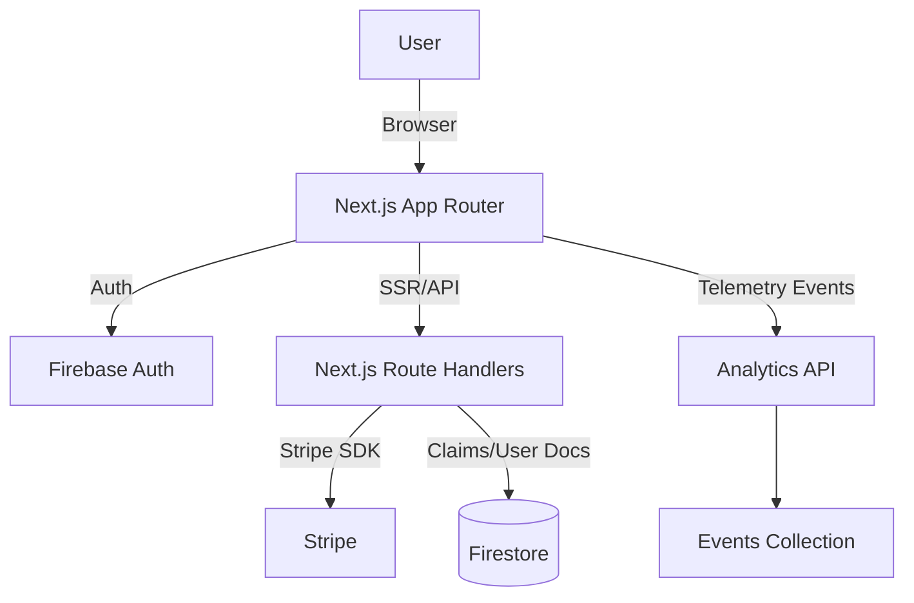

# Architecture

> High-level view of Next.js app (App Router), Firebase (Auth + Firestore), Stripe payments, and observability.

## Components
- **Frontend (L6):** App Router pages, shadcn/ui, forms, role gates
- **Server (L6):** Route handlers for jobs, applications, users (claims), Stripe
- **Data (L2):** Firestore (users, jobs, applications), indexes
- **Security (L9):** Firebase rules, custom claims, rate limits, Stripe signatures
- **Observability (L5):** Events API, error reporting, dashboards
- **Build/Deploy (L4):** Vercel, envs, bundle budgets

## Data Flow (Happy Path)
1. Auth → claims bootstrap → role-directed dashboard
2. Owner creates job → Firestore write (rules enforce ownership)
3. Seeker applies → application doc created → owner sees in dashboard
4. Subscription via Stripe Checkout → webhook updates subscription status
5. Analytics events emit on auth, subscribe, post job, apply
